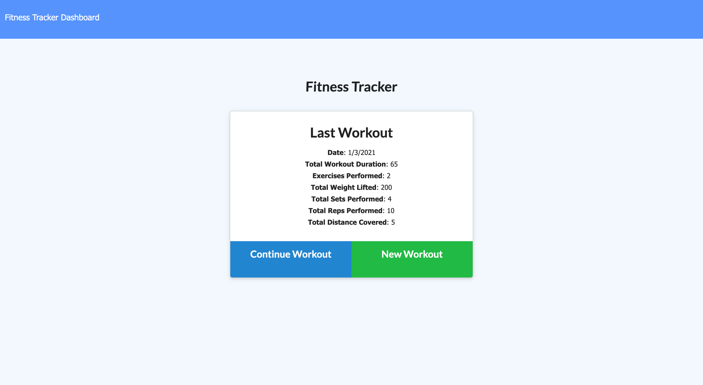
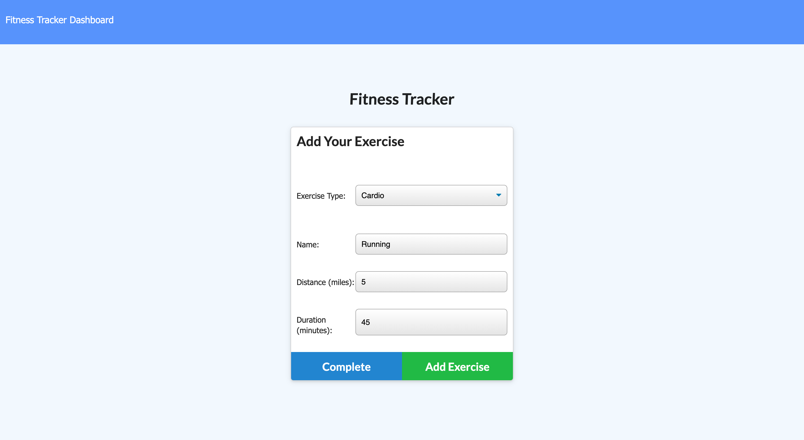
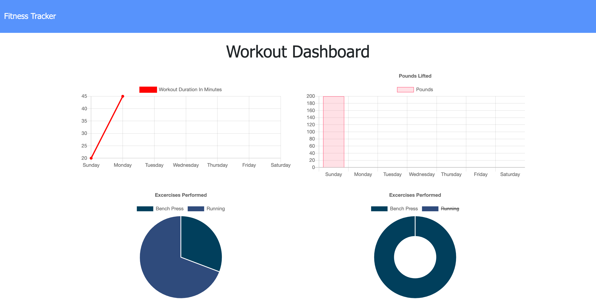

# Workout Tracker

## Description 
This MongoDB workout tracking application assists the user in reaching their fitness goals quickly by allowing them to tracking their workouts and receive visual statistics on their workouts over time.

## Table of Contents  
* [Usage](#usage)
* [License](#license)
* [Contributing](#contributing)
* [Tests](#tests)
* [Questions](#questions)
* [Links](#links)

## Usage 

On the homepage, the last workout will be displayed. The user will be able to to create a new workout or continue to add exercises to the last workout.

When creating or adding exercises the user can choose from cardio or resistance exercises. If they are tracking a resistance exercise the user will be prompted to enter the name, weight, sets, reps, and duration of that specific exercise. If they are tracking a cardio exercise the user will be prompted to add the exercise name, distance, and duration. After the user has entered the exercise information they can press add exercise to add the exercise to their workout and then enter another exercise or they can press complete to add the exercise, complete the workout, and be directed back to the homepage.

When the user presses "Dashboard" on the homepage they will be transported to the stats page. Here, the user will see their workout data charted.

## License
This project is licensed under the MIT license.

## Contributing
To contribute to this project you can fork this GitHub repository.

## Questions
If you have any additional questions about this application you can reach out to me at briannahebeler@gmail.com.
You can check out some of my other projects at briannahebeler (https://github.com/briannahebeler).

## Links
* The URL to the deployed application: https://workout-tracker-briheb.herokuapp.com/
* The URL to the GitHub repository: https://github.com/briannahebeler/workout-tracker